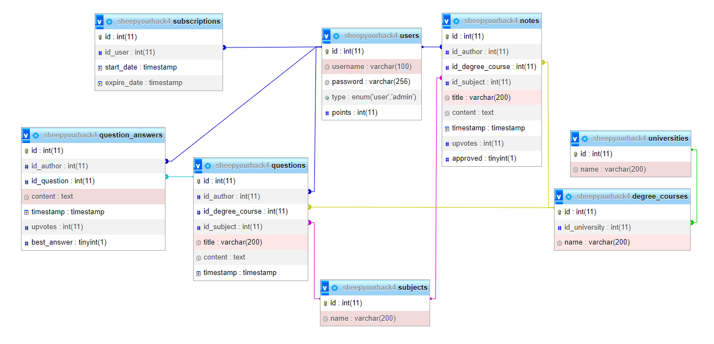

# Study Notes - server

This repository only contains the server's code. For the main repository, see [Truly-Depressed-Developers/study-notes](https://github.com/Truly-Depressed-Developers/study-notes)

## Features

- Data storage in database
- Basic login and register
- Data access and modification through appropriate endpoints

## Tech Stack


## Installation

### Prerequisities

- XAMPP
- Node.js

### Database

1. Launch Apache and MySQL in XAMPP Control Panel
2. Open [localhost/phpmyadmin](https://localhost/phpmyadmin) and import database from [SQL file](./sheepyourhack4.sql) 
3. (optional) Create new user and grant him access to sheepyourhack4 database

### Server

Clone this repo on your local machine
```
git clone https://github.com/MBrosik/sheepyourhack4-server.git
cd sheepyourhack4-server
```

Install node modules
```
npm install
```

Update IP and login credentials in [Database.ts](./src/Database.ts). If you skip 3rd step in Database, default should be:
- host: "localhost"
- user: "root"
- password: ""
- database: "sheepyourhack4"

Run build once to create build folder
```
npm run build
```

Start server
```
npm run start
```

## Database structure


## Endpoints
<table>
	<tr>
		<th>Endpoint (POST)</th>
		<th>Required data</th>
		<th>Returned data</th>
 	</tr>
 	<tr>
  		<td>/login</td>
   		<td>
            <ul>
                <li>username: string</li>
                <li>password: string</li>
            </ul>
        </td>
   		<td>
            <ul>
                <li>description: string</li>
                <li>id: number</li>
            </ul>
        </td>
    </tr>
 	<tr>
  		<td>/register</td>
   		<td>
            <ul>
                <li>username: string</li>
                <li>password: string</li>
            </ul>
        </td>
   		<td>
            <ul>
                <li>description: string</li>
            </ul>
        </td>
    </tr>
    <tr>
  		<td>/get_one_question</td>
   		<td>
            <ul>
                <li>id: number</li>
            </ul>
        </td>
   		<td>
            <ul>
                <li>question</li>
                    <li>id: number</li>
                    <li>username: string</li>
                    <li>university: string</li>
                    <li>degree_course: string</li>
                    <li>subject: string</li>
                    <li>title: string</li>
                    <li>content: string</li>
                    <li>points: number</li>
                    <li>excercise_set: string</li>
                    <li>timestamp: string</li>
                    <li>answers: list of:
                        <ul>
                            <li>username: string</li>
                            <li>content: string</li>
                            <li>timestamp: string</li>
                            <li>upvotes: number</li>
                            <li>best_answer: bool</li>
                        </ul>
                    </li>
            </ul>
        </td>
    </tr>
    <tr>
  		<td>/add_question</td>
   		<td>
            <ul>
                <li>id_author: number</li>
                <li>id_degree_course: number</li>
                <li>id_subject: number</li>
                <li>title: string</li>
                <li>points: number</li>
                <li>excercise_set: string</li>
                <li>content: string</li>
            </ul>
        </td>
   		<td>
            <ul>
                <li>status: bool</li>
            </ul>
        </td>
    </tr>
    <tr>
  		<td>/add_answer</td>
   		<td>
            <ul>
                <li>id_question: number</li>
                <li>id_author: number</li>
                <li>content: string</li>
            </ul>
        </td>
   		<td>
            <ul>
                <li>status: bool</li>
            </ul>
        </td>
    </tr>
    <tr>
  		<td>/get_universities</td>
   		<td></td>
   		<td>
            list of:
            <ul>
                <li>id: number</li>
                <li>name: string</li>
            </ul>
        </td>
    </tr>
    <tr>
  		<td>/get_courses</td>
   		<td>
            <ul>
                <li>id_university: number</li>
            </ul>
        </td>
   		<td>
            list of:
            <ul>
                <li>id: number</li>
                <li>name: string</li>
            </ul>
        </td>
    </tr>
    <tr>
  		<td>/get_subjects</td>
   		<td></td>
   		<td>
            list of:
            <ul>
                <li>id: number</li>
                <li>name: string</li>
            </ul>
        </td>
    </tr>
    <tr>
  		<td>/get_notes</td>
   		<td>
            <ul>
                <li>id_university: number | undefined</li>
                <li>id_subject: number | undefined</li>
                <li>id_degree_course: number | undefined</li>
            </ul>
        </td>
   		<td>
            list of:
            <ul>
                <li>id: number</li>
                <li>username: string</li>
                <li>university: string</li>
                <li>degree_course: string</li>
                <li>subject: string</li>
                <li>title: string</li>
                <li>timestamp: string</li>
                <li>upvotes: number</li>
                <li>approved: bool</li>
            </ul>
        </td>
    </tr>
    <tr>
  		<td>/get_one_note</td>
   		<td>
            <ul>
                <li>id: number</li>
            </ul>
        </td>
   		<td>
            <ul>
                <li>id: number</li>
                <li>username: string</li>
                <li>university: string</li>
                <li>degree_course: string</li>
                <li>subject: string</li>
                <li>title: string</li>
                <li>url: string</li>
                <li>timestamp: string</li>
                <li>upvotes: number</li>
                <li>approved: bool</li>
            </ul>
        </td>
    </tr>
    <tr>
  		<td>/add_note</td>
   		<td>
            <ul>
                <li>id_author: number</li>
                <li>id_degree_course: number</li>
                <li>id_subject: number</li>
                <li>title: string</li>
                <li>url: string</li>
            </ul>
        </td>
   		<td>
            <ul>
                <li>status: bool</li>
            </ul>
        </td>
    </tr>
</table>
					

## License

This project is licensed under [MIT](./LICENSE) license.